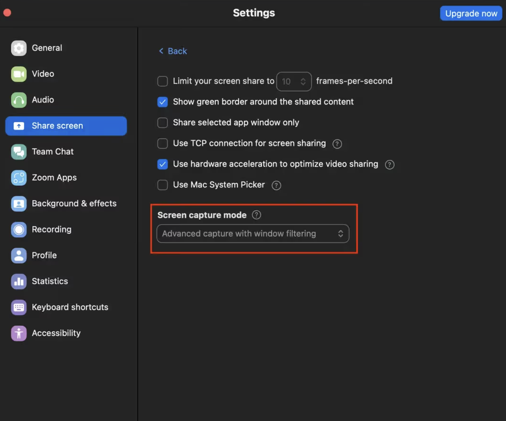

<div align="center">

# OpenCluely

**A free, open-source AI copilot that sees your screen, hears your meetings, and stays invisible while it does it.**

Bring your own AI key — OpenAI · Anthropic · Gemini · Mistral · NVIDIA · Ollama · OpenRouter · Custom

[](LICENSE)
[](#quick-start)
[](https://github.com/rahulcvwebsitehosting/OpenCluely)


</div>

---

## What it does

A small glass panel floats over everything on your screen. It reads **three inputs** — your screen, your microphone, and the audio from your call — and uses any AI model you connect to help you in real time. It's excluded from screen-share and screen-recording capture, so it's visible to you and invisible to everyone else on the call.

| Feature | Shortcut | What it uses |
|---|---|---|
| **Assist** — do the smart thing right now | `⌘`/`Ctrl` + `↵` | screen + conversation |
| **What should I say?** | button | meeting audio |
| **Follow-up questions** | button | conversation |
| **Recap** — catch up a late joiner | button | conversation |
| **Solve coding problem** | `⌘`/`Ctrl` + `H` | screen only |



## Quick start

```bash
git clone https://github.com/rahulcvwebsitehosting/OpenCluely.git
cd OpenCluely
npm install && npm start
```

Or grab a build from [Releases](https://github.com/rahulcvwebsitehosting/OpenCluely/releases).

1. Open Settings (gear icon), pick any provider, paste your API key
2. Press `⌘↵` / `Ctrl+↵` to assist with whatever's on screen

> Windows users: see [WINDOWS_SUPPORT.md](WINDOWS_SUPPORT.md) for platform-specific notes.

## Why OpenCluely?

- **Free.** No subscriptions, no accounts, no telemetry.
- **Your keys.** Bring your own API key from any provider — you pay the provider directly, nothing marked up.
- **Local models.** Point it at Ollama and run the whole thing offline.
- **Private.** Keys and settings live in a local JSON file. No servers, no analytics, no data leaves your machine except to the AI provider you chose.
- **Custom.** Add any OpenAI-compatible endpoint.
- **Open source.** GPL-3.0. Read the code, fork it, change it.

## How it stays invisible

On macOS, OpenCluely uses `setContentProtection` to exclude its own window from screen capture — the OS-level API that keeps DRM content hidden from screenshots also hides this panel from Zoom, Meet, OBS, and screen-recording software. You see it; a screen share doesn't.

## A note on how you use this

OpenCluely is a general-purpose "see my screen, hear my call" AI tool — it doesn't know or care whether you're using it to keep pace in a fast-moving standup, practice for an interview, or get a live assist during a call. That judgment call is yours. Using it to misrepresent your own skills or knowledge in a context where you're expected to demonstrate them yourself (a graded exam, a job interview you're expected to pass unaided) is on you, not the tool.

## Contributing

Issues and PRs welcome. The codebase is small and readable on purpose:

```
main.js         → Electron main process, IPC, window/overlay behavior
preload.js      → renderer bridge
src/llm.js      → provider abstraction (OpenAI/Anthropic/Gemini/Mistral/NVIDIA/Ollama/OpenRouter)
src/prompts.js  → the actual prompts behind each mode
src/stt.js      → speech-to-text
src/screen.js   → screenshot capture
src/store.js    → local settings persistence
renderer/       → UI
```

## Creator

Built by [Rahul Shyam](https://rahulshyam-portfolio.vercel.app/)

| Platform | Link |
|---|---|
| LinkedIn | https://linkedin.com/in/rahulshyamcivil |
| X / Twitter | https://x.com/RahulShyamCV |
| Threads | https://threads.com/@rahulcvjps |
| GitHub | https://github.com/rahulcvwebsitehosting |

## License

[GPL-3.0-or-later](LICENSE) — free to use, modify, and share.
