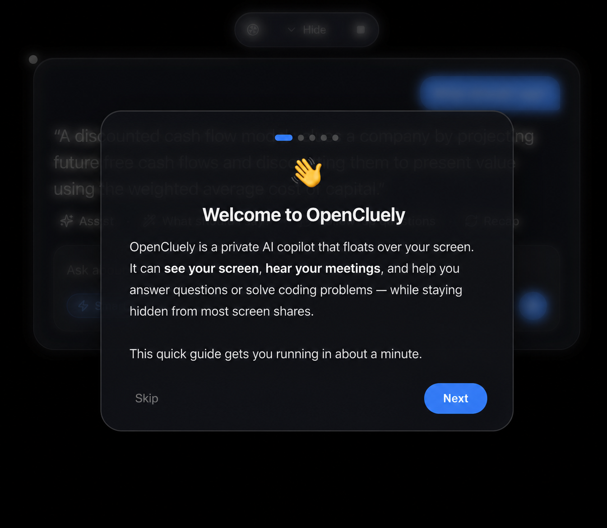

<div align="center">

# OpenCluely

**Your free, open-source AI copilot — sees your screen, hears your meetings, keeps you sharp.**

Bring your own AI key (OpenAI · Anthropic · Gemini · Mistral · NVIDIA · Ollama · OpenRouter · Custom)



</div>

---

## What it does

A small glass panel floats over everything. It takes **three inputs** — your screen, your microphone, and meeting audio — and uses any AI model to help you in real time.

| Feature | Shortcut | What it uses |
|---|---|---|
| **Assist** | `⌘`/`Ctrl` + `↵` | screen + conversation |
| **What should I say?** | button | meeting audio |
| **Follow-up questions** | button | conversation |
| **Recap** | button | conversation |
| **Solve coding problem** | `⌘`/`Ctrl` + `H` | screen only |

## Quick start

1. Download from [Releases](https://github.com/rahulcvwebsitehosting/OpenCluely/releases) or run from source:
   ```bash
   git clone https://github.com/rahulcvwebsitehosting/OpenCluely.git
   cd OpenCluely
   npm install && npm start
   ```
2. Open Settings (gear icon), pick any provider, paste your API key
3. Press `⌘↵` to assist with whatever's on screen

## Why OpenCluely?

- **Free.** No subscriptions. No accounts. No telemetry.
- **Your keys.** Bring your own API key from any provider.
- **Local models.** Use Ollama to run everything offline.
- **Private.** Keys stored locally. No servers. Collects nothing.
- **Custom.** Add any OpenAI-compatible provider.

## Creator

Built by [Rahul Shyam](https://rahulshyam-portfolio.vercel.app/)

| Platform | Link |
|---|---|
| LinkedIn | https://linkedin.com/in/rahulshyamcivil |
| X / Twitter | https://x.com/RahulShyamCV |
| Threads | https://threads.com/@rahulcvjps |
| GitHub | https://github.com/rahulcvwebsitehosting |

## License

[GPL-3.0-or-later](LICENSE) — free to use, modify, and share.
